## 从此 Typora 代码块有了颜色

给Typora 代码块添加默认颜色，让代码块亮起来

### 起因

平时喜欢用typora记笔记，但是typora默认代码块没有指定语言，没有高亮看着很不舒服，所以用Autohotkey花了半天写了个脚本，按自己的快捷键就可以自动生成代码块并添加语言，这样就方便很多。后来想着在光标处添加个输入法中英文提示，这样就不用每次在输入的时候低头看输入法状态了。脚本写了三个版本。

> 注：如下方式，测试使用的是搜狗输入法，windows自带输入法不行，windows输入法太难用了，天天打错字，懒得搞它。

### Show_shurufa_v2-1 白名单版

> 白名单版
>
> **功能**
>
> ​	可以实现typora的代码块自动添加语言，默认是java,下面可以通过 code_block自定义设置
>
> ​	代码块快捷键默认是Ctr+alt+k，可以修改想要修改可以通过下面代码实现
>
> ​		常用热键：Ctrl=^ alt=! 字母键=字母键，如 a=a
>
> ​		其他热键看官方文档：https://wyagd001.github.io/v2/docs/Hotkeys.htm
>
> ​	鼠标指向输入框变成工字型或者按shift键的时候，会提示当前输入法的是中文还是英文，显示时间为1s
>
> ​	输入法默认也是只有在输入状态时按shift才会切换。
>
> ​	做了白名单的限制，只在Typora wps word vscode idea Pycharm上显示
>
> 开销很小，占用内存2M左右，CPU几乎不占用。

### Show_shurufa_v2-2 黑名单版

> 黑名单版
>
> **功能**
>
> ​	可以实现typora的代码块自动添加语言，默认是java,下面可以通过 code_block自定义设置
>
> ​	代码块快捷键默认是Ctr+alt+k，可以修改想要修改可以通过下面代码实现
>
> ​		常用热键：Ctrl=^ alt=! 字母键=字母键，如 a=a
>
> ​		其他热键看官方文档：https://wyagd001.github.io/v2/docs/Hotkeys.htm
>
> ​	鼠标指向输入框变成工字型或者按shift键且在输入状态时，才会提示当前输入法的是中文还是英文，显示时间为1s
>
> ​	输入法默认也是只有在输入状态时按shift才会切换。
>
> ​	做了黑名单的限制，因为wps 不能正常识别，所以剔除了，其他程序都可以。
>
> 开销很小，占用内存2M左右，CPU几乎不占用。

### typora_v2 typora代码块快捷键自动添加语言

> **功能**
>
> ​	可以实现typora的代码块自动添加语言，默认是java,下面可以通过 code_block自定义设置
>
> ​	代码块快捷键默认是Ctr+alt+k，可以修改想要修改可以通过下面代码实现
>
> ​		常用热键：Ctrl=^ alt=! 字母键=字母键，如 a=a
>
> ​		其他热键看官方文档：https://wyagd001.github.io/v2/docs/Hotkeys.htm

### 功能展示

**鼠标指针变成工字型，即输入状态，点击一下就会显示当前输入法状态，显示1s**

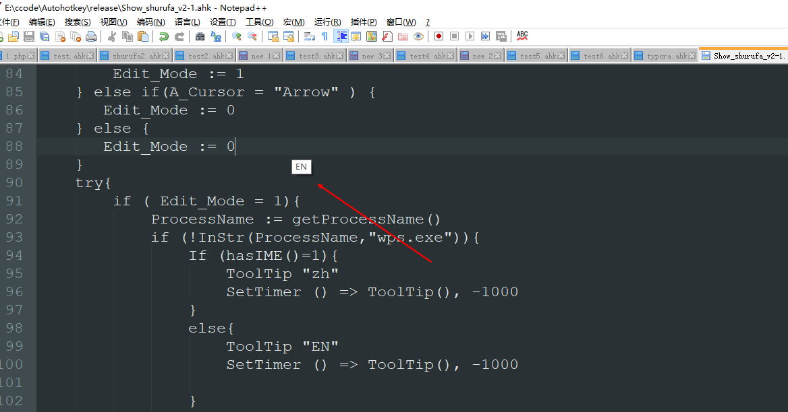

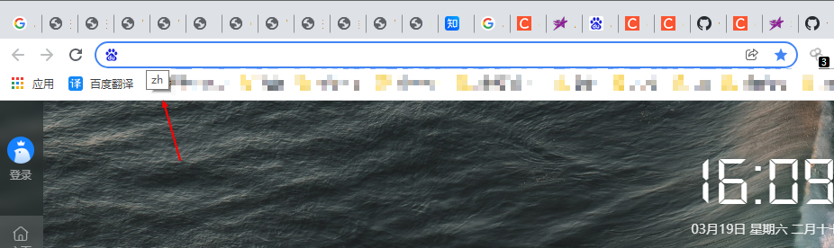

**typora 下显示输入法状态**

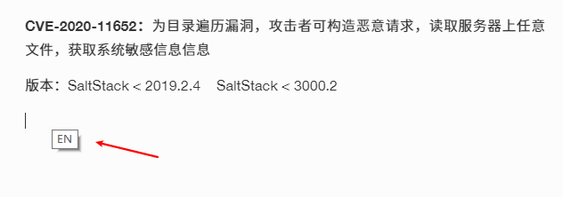

**vscode下显示输入法状态**

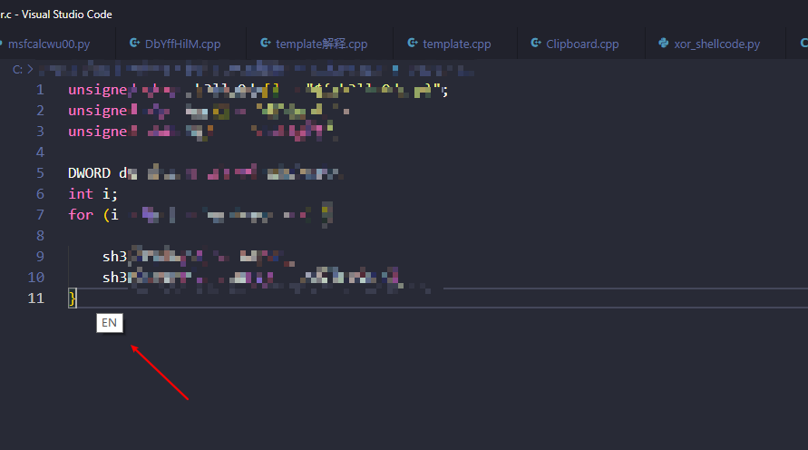

**单击shift切换中英文可以显示当前输入法状态，显示1s**

图片效果展示不出来，大家可以下载了自己去试

**tpyora代码块快捷键自动添加语言**

我的快捷键是Ctrl+r，设置的代码块语言默认是java，大家可以根据自己的情况去文件中修改。

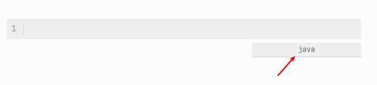

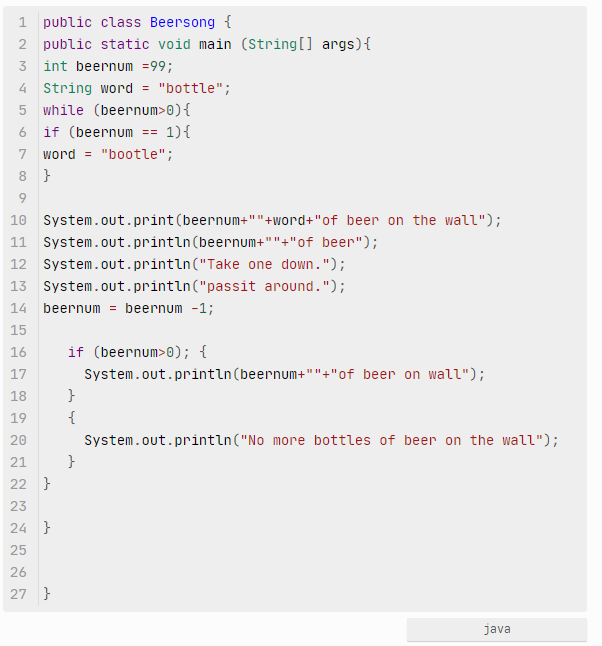

### 使用

下载后，先点开要使用的对应的版本的ahk文件，修改typora生成代码块快捷键设置的代码块语言默认是java，然后保存。

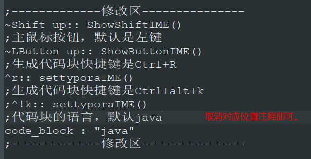

点击里面的vbs脚本运行即可，没毒，vbs里面就两行代码。

用的AutoHotKey V2编写的还不能编译成exe，所以只能这样用。

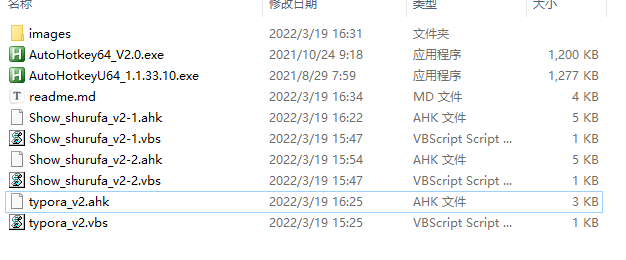

运行后，任务栏右下角会有个小图标

可以看到就占2M内存，很小。

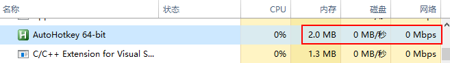

为什么不用Python写，效率低，占内存高，占CPU高。

下载链接： https://github.com/komomon/AutoHotkeyScript

### 最后

关注**Z2O安全攻防** 公众号回复“**加群**”，添加Z2OBot 小K自动拉你加入**Z2O安全攻防交流群**分享更多好东西。

小K每日在群里发送最新检测到的POC和攻防日报。

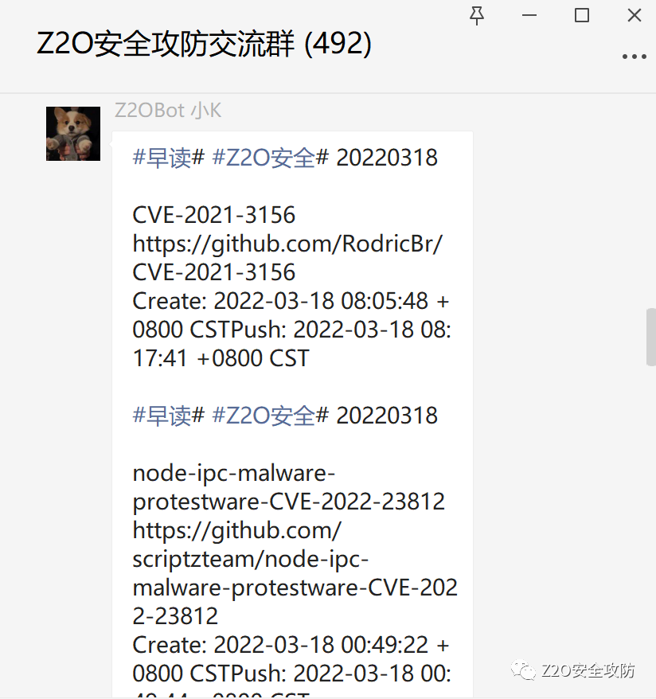

**知识星球**

团队建立了知识星球，不定时更新最新漏洞复现，手把手教你，同时不定时更新POC、内外网渗透测试骚操作。感兴趣的可以加一下。

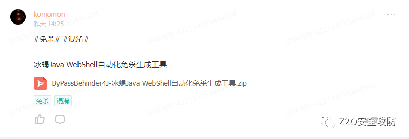

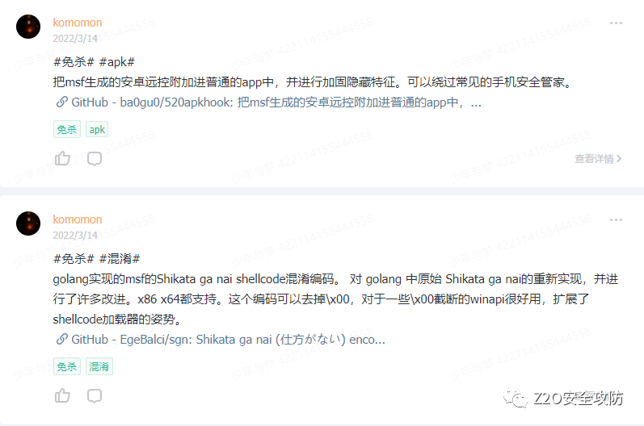

**欢迎Star O(∩_∩)O**

